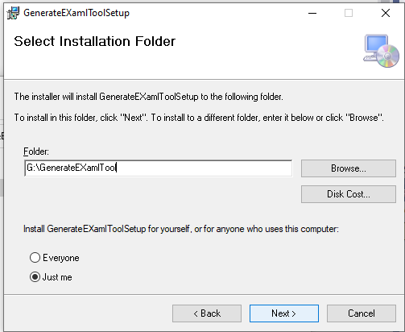
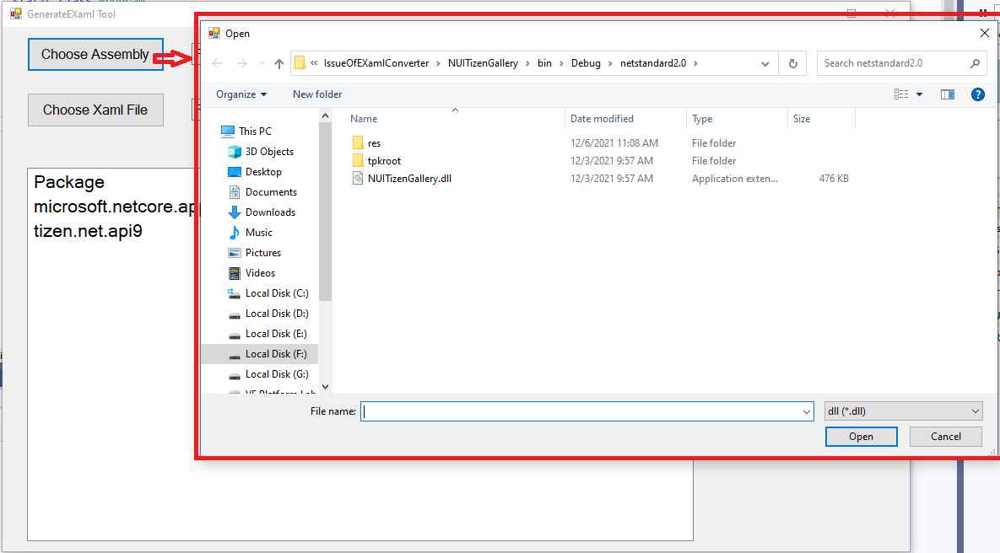
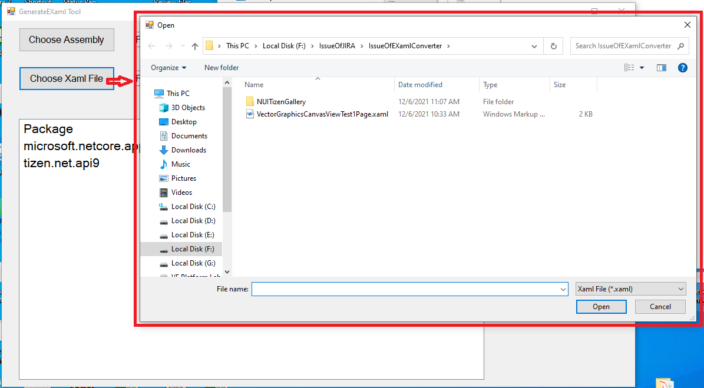
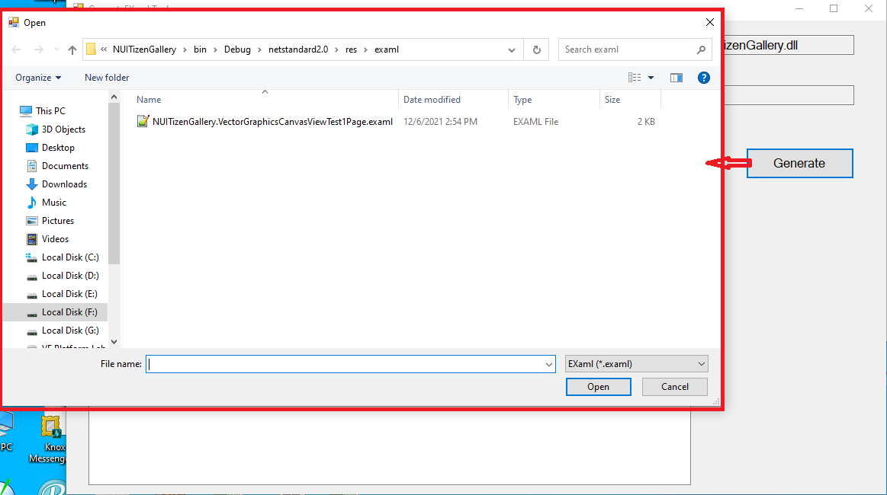

# GenerateEXamlTool
This tool is used to generate .examl from from .xaml file.

# Install
1. Open the GenerateEXamlToolSetup/Debug/GenerateEXamlToolSetup.msi
2. Select folder

# Use the Tool
1. Choose the .dll or .exe of assembly

2. Choose the .xaml file which need to convert

3. Click "Generate" button

